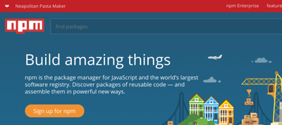
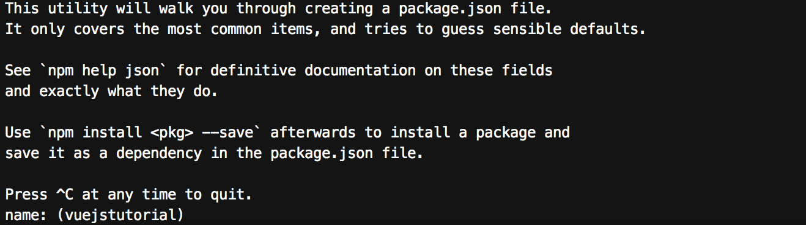
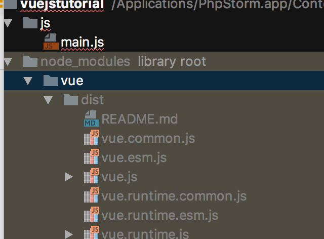
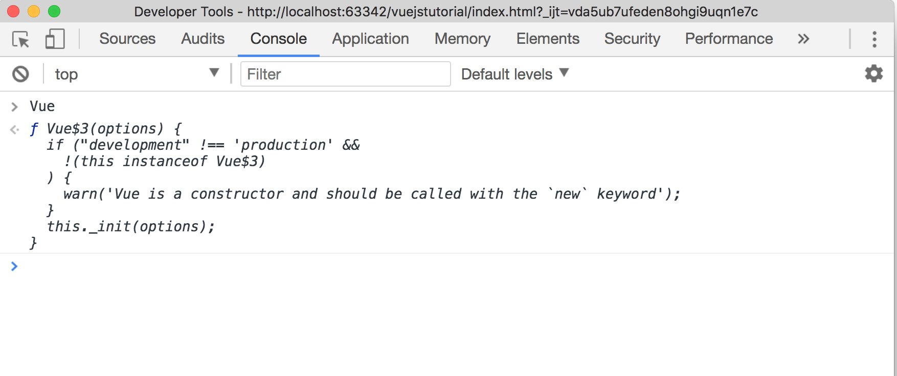

# Introducing Vue.js and Package Managers


## JavaScript Frameworks

- The current web development ecosystem has seen a rapid rise of JavaScript [frameworks](http://todomvc.com/).  Such frameworks speed up the development process by enforcing structure and taking care of repetitive tasks such as DOM access and manipulation. 

- **For your assessment you are free and encouraged to make use of JavaScriptFrameworks and tools. In fact, I actively encourage this as it is how media web sites and applications are built**
 
### What about jQuery 

- You may have heard of a jQuery. Historically it was a widely used JavaScript library and is therefore Libraries unlike frameworks do not enforce any coding structure or patterns, you can think of them as extensions of the language. 

- jQuery historically solved two problems:

	- It simplified common javaScript operations
	- It ensured modern javaScript features worked across different browsers

- Its drop in popularity is perhaps down to modern web browsers offering greater levels of support for javaScript features. Furthermore, much of the javaScript operations it simplified can be achieve much more elegantly using a good framework. 


# The Vue.js Framework

- In order to fully appreciate the benefits of using a javascript framework we are going to be experimenting with Vue.js. 

- [Vue.js](vuejs.org) is a powerful yet lightweight javascript framework. It was loosely based on a competing framework, AngularJS. While Vu.js has many of the features that made AngularJs the most popular javaScript framework.  Unlike AngularJS, it is very easy to learn. 


## Including Vue.js in your project

- When working with any third party library you should set up your website project structure as normal 

- Next, In order to include vue into our project we need to download the library.

- While it's possible to download it from a the website. We're going to use a package manager.

## The NPM Package Manager


- Non-trival web applications are rarely built from scratch, instead they rely on third party libraries and components. 
- Using a package manger allows us to easily consume third party packages. Furthermore, it allows you to omit these third party packages from you git repository. The result is you project is lightweight, portable and will be using up-to-date packages




>> **Figure 1**, The NPM registry ([https://www.npmjs.com/](https://www.npmjs.com/)). 

- While their are several competing front end development package managers, the Node Package Manager (NPM) is by far the most popular


### Setting up NPM



>> **Figure 2**, The NPM init utility

- To use the NPM package manager, firstly nodeJS needs to be installed. If you are using clou9 this has already been done for you. If you are on your own computer, it's a simple case of downloading and click installing the binary from the nodeJs website
- To initiate your project, using command line navigate to the root directory of your website. Run the command `npm init`
- If all goes well the npm init utility will run and ask you a  number of questions. Normally people just repeatedly press enter to go with the defaults

```
{
  "name": "vue_experiment",
  "version": "1.0.0",
  "description": "",
  "main": "index.js",
  "scripts": {
    "test": "echo \"Error: no test specified\" && exit 1"
  },
  "author": "",
  "license": "ISC",
  "dependencies": {
    "vue": "^2.5.3"
  }
}

```
>> **Listing 1**,  the package.json file 


- After running `npm init` you notice that it has created a `package.json` file (Listing 1)
- JSON stands for Java Script Object Notation. It's simply used to represent data. In the case of the `package.json` file the data will represent a schema for our application's dependancies.

**Installing a Dependancy**

- Let's install our first dependancy, run `npm install vue --save`
- You should see that a node_modules folder has been created and within it is the Vue library


>> **Figure 3**, The contents of the node_modules folder

- Note, while there are lots of files and folders generally the main library will live in the dist folder. 

**Ignore the node_modules**

- You should never edit or store the `node_modules` folder in a git repository
- Since our `package.json` contains information about our application's dependancies all we don't need to port the `node_modules` folder around


```
/node_modules
```
>> **Listing 2**, The contents `.gitignore` file, excluding node modules from the repo


- You may remember, we can instruct git to ignore files and folders by setting up a `.gitignore` and adding `/node_modules` to it. 


# Working with VUE 

- Within your project folder, you'll need to create a `js/main.js` file and a `index.html` file

```
<html>

......

<script src="node_modules/vue/dist/vue.js"></script>
<script src="js/main.js"></script>
</html>

```

>> **Listing 3**, including vu.js into one of our projects html pages

- Once installed, Due can now be included into our project's html pages (Listing 3)

- Notice how we include the javaScript at the bottom of the page. This ensures the HTML is rendered before our javaScript is loaded. Also, notice how our `main.js` file is included after the `vue.js` file. Order does matter!


>> **Figure 4**, The Vue library object. This can be tested by tying `Vue` into your browsers console window

- If all has gone well we now should have access to the Vue javaScript framework (Figure 4)

## Creating a vue application


**main.js**

```
var app = new Vue({
    el: '#app',
    data: {
        message: 'Hello',
        name: 'Joe'
    }
});

```

**index.html**

```
.....
<html>
	<div id="app">
		<p> {{message}} {{name}}</p>
	</div>

</html>

```
>> **Listing 4**, including vu.js into one of our projects html pages

- Listing 4 demonstrates how we create a new Vue instance. Notice how we pass in the settings using a javaScript object literal containing our app settings	
	
	- `el` is the element that contains our application in this case `#app
	- `data` is  child object literal that contains data that can easily be rendered in the HTML using the `{{` brackets

	
- If all has worked well, you should see that `{{message}} {{name}}` is replaced by `Hello Joe`

**main.js**

```
var app = new Vue({
    el: '#app',
    data: {
        message: 'Hello Vue!',
        userInput: ''
    },
    methods: {
        setMessage: function () {
            this.message = this.userInput;
        }
    }
});
```

**index.html**

```
.....
<html>
	<div id="app">
		 {{message}} 
		 <input type="text" v-model="userInput"> 
       <button v-on:click="setMessage">Click Me</button>
	</div>

</html>

```

>> **Listing 5**, binding to events and capturing user input is easy in view

- The benefits of Vue become even more apparent when bind to events and work with user inputs. 

- Consider **Listing 5**, notice on the button we implement the attribute `v-on:click="setMessage`. This will run the corresponding method in `main.js` on a click event.

- The method   `setMessage`  simply has one instruction `this.message = this.userInput;`. Which sets the contents of the text box, to `this.message`. This will result in the ``{{message}}`` being updated	
	- **this** is our current Vue instance and `.message` is the data property `message`.  
	- **`this.userInput` is the contents of out input box. This relationship is set up using the  `v-model="userInput"` attribute


## Vue Components 


>> **Figure 4**, Components can be considered Russian dolls


- So far our application logic is bound to the main global instance of our Vue application. This is fine for very small apps, however quickly becomes unmanageable.

- To compose bigger application we use the Vue uses the concept of web components. The idea is to create a application that is the product of lots of small simple components

- Components can live within other components, hence the idea of the Russian dolls

**js**

```
Vue.component('my-component', {
    template: `<div>{{message}} 
              <input type="text" v-model="userInput"> 
              <button v-on:click="setMessage">Click Me</button>
              </div>`,
    data: function() {
        return {
            message: 'Hello Vue!',
            userInput: ''
        }


    },
    methods: {
        setMessage: function () {
            this.message = this.userInput;
        }
    }
});

new Vue({
    el: '#app'
});
```

**html**

```
<body>


<div id="app">
    <my-component></my-component>
</div>
<!-- #app -->

</body>
```

>> **Listing 5**, creating reusable components

- Above (Listing 5) we declare a Vue component. Notice how we come up with our now name and then use that name directly within our html. 
`<my-component>` will be replaced by our components template. 

- This is a very powerful concept, as we can now use our component anywhere in our application by just inserting `<my-component>` into the html


# Practical 

[Using vu.js](task.md)